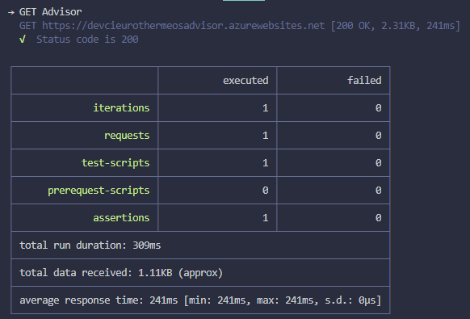

# Example Postman Test Project

## Setup
- Clone the repository
- Run `npm install`
- If working behind a proxy:- Set OS global env variable 'http_proxy'=<proxy address:port>

## Running Tests

To run tests against the **CI** environment

`npm run test:ci`

To run tests against the **TEST** environment

`test:test`

To run an example tests against **Google**

`test:google`

### Example Output

